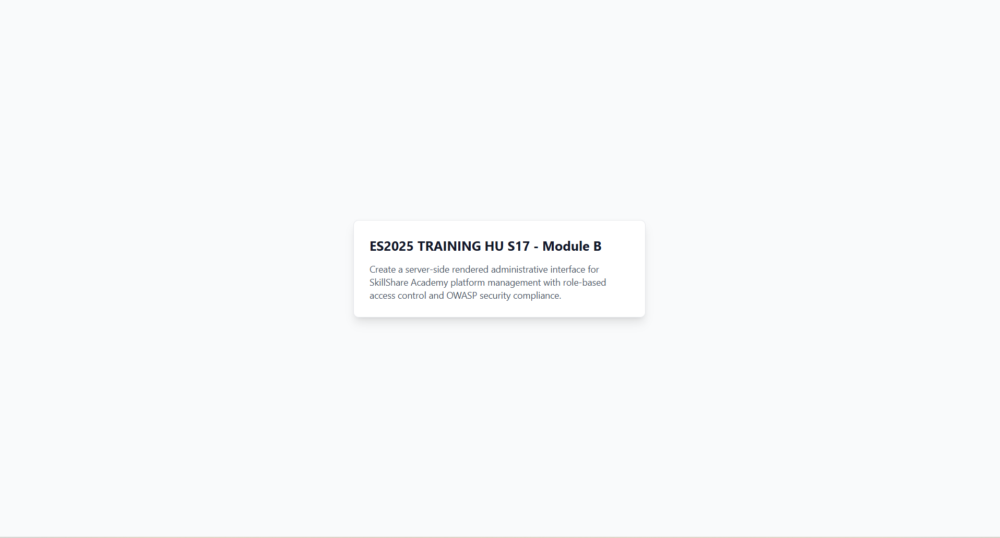

# Module 1: Project Setup & Your First Card

## Overview

In this module, you'll set up a modern React development environment and create your first UI component - a simple project card. By the end of this module, you'll have a beautifully styled card centered on the screen, built entirely with Tailwind CSS utility classes.

## What is Tailwind CSS?

**Tailwind CSS** is a utility-first CSS framework that allows you to build modern user interfaces rapidly without writing custom CSS. Instead of writing CSS rules in separate stylesheets, you apply pre-defined utility classes directly to your HTML elements.

### Traditional CSS vs Tailwind

**Traditional approach:**

```css
/* styles.css */
.card {
  padding: 1.5rem;
  background-color: white;
  border-radius: 0.5rem;
}
```

```html
<div class="card">Content</div>
```

**Tailwind approach:**

```html
<div class="p-6 bg-white rounded-lg">Content</div>
```

### Why Developers Love Tailwind

- **Faster development** - No switching between HTML and CSS files
- **Consistency** - Uses a design system with predefined spacing, colors, and sizes
- **No naming** - No need to invent class names like `.card-container-wrapper`
- **Smaller CSS** - Tailwind removes unused styles in production
- **Responsive design** - Built-in utilities for breakpoints (`md:`, `lg:`, etc.)

### Key Concepts

- **Utility classes** - Single-purpose classes like `p-4` (padding), `text-xl` (text size)
- **Composition** - Combine multiple utilities to create complex designs
- **No magic** - Each class maps to standard CSS properties
- **JIT compilation** - Tailwind generates only the CSS you actually use

In this module, you'll learn by doing - building a real card component and understanding how Tailwind's utilities work together!

## What You'll Learn

- Setting up a **Vite + React + TypeScript** project
- Installing and configuring **Tailwind CSS v4** with the Vite plugin
- Understanding Tailwind's **utility-first** approach
- Using **flexbox** for centering elements
- Creating a card component with:
  - Background and padding
  - Borders and rounded corners
  - Shadows for depth
  - Typography styling

## Why This Matters

This module establishes the foundation for everything that follows. Understanding how to:

1. **Set up a modern React project** - Vite provides lightning-fast development with hot module replacement
2. **Use Tailwind CSS** - Utility classes allow rapid UI development without writing custom CSS
3. **Build basic components** - Cards are fundamental UI building blocks used everywhere

## PRD Connection

This module implements the first part of the **MITS Project Dashboard** (see PRD):

> **Core Features → Project Cards → Visual Components**
>
> - Title - Large, bold heading displaying the module name
> - Description - Truncated text preview

We're starting simple with just these two elements, centered on the screen. In later modules, we'll add more features like badges, tags, colors, and themes.

## Prerequisites

Before starting this module, ensure you have:

- **Node.js** (v18 or higher) - [Download here](https://nodejs.org/)
- **npm** (comes with Node.js)
- **Git** - [Download here](https://git-scm.com/)
- A **GitHub account** - [Sign up here](https://github.com)
- A **code editor** (VS Code recommended)
- Basic knowledge of **HTML, CSS, and JavaScript**
- Familiarity with **React basics** (components, JSX)

## Time Estimate

**30-45 minutes**

## Module Structure

1. **Task 1**: Create a new Vite + React + TypeScript project
2. **Task 2**: Install and configure Tailwind CSS
3. **Task 3**: Clean up default files
4. **Task 4**: Create a simple centered card
5. **Task 5**: Style the card with Tailwind classes
6. **Task 6**: Set up version control with Git & GitHub

## Expected Result

By the end of this module, you'll have:

A single card centered on the screen with:

- White background
- Rounded corners and subtle border
- Shadow for depth
- Bold title and muted description text
- Gray page background


Let's get started!
